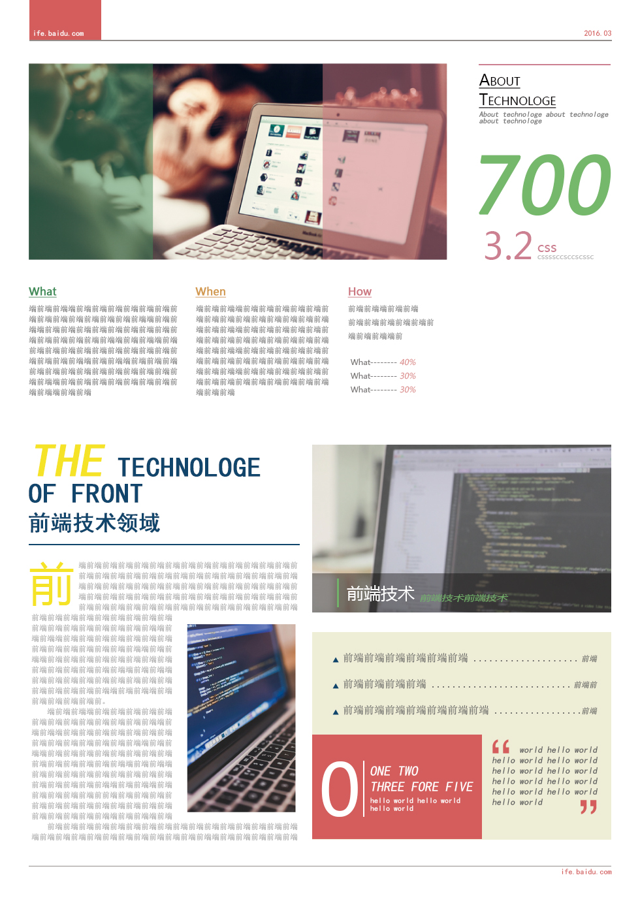

### Object

1.深入掌握CSS中的字体、背景、颜色等属性的设置
2.进一步练习CSS布局

### Description 

1.参考 PDS设计稿，实现页面开发，要求实现效果与 样例 基本一致
2.页面中的各字体大小，内外边距等可参看 标注图
3.页面宽度固定（定宽）

### Attention

1.只需要完成HTML，CSS代码编写，不需要写JavaScript
2.设计稿中的图片、文案均可自行设定
3.在Chrome中完美实现符合标注中的各项说明
4.有能力的同学可以尝试跨浏览器的兼容性
5.有能力的同学可以在实现一遍后尝试用less, sass或者stylus等再实现一次